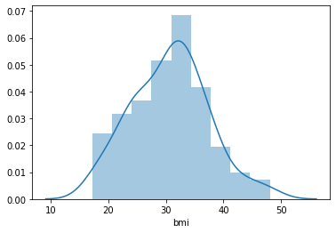

# PROJECT-EDA_Healthcare
The data at hand contains medical costs of people characterized by certain attributes. Explore and generate value out of this data.


## Exploratory Data Analysis


```python
#!pip install seaborn
```


```python
import sys
sys.version
```


    '3.7.4 (default, Aug  9 2019, 18:34:13) [MSC v.1915 64 bit (AMD64)]'


```python
#Import the necessary libraries
import pandas as pd
import numpy as np
import matplotlib.pyplot as plt
import seaborn as sns
from scipy import stats
from statsmodels.formula.api import ols
from statsmodels.stats.anova import anova_lm
```


```python
#Read the data as a data frame
data = pd.read_csv('insurance (2)', delimiter=',', header='infer')
data.head()
```


<div>
<style scoped>
    .dataframe tbody tr th:only-of-type {
        vertical-align: middle;
    }

    .dataframe tbody tr th {
        vertical-align: top;
    }

    .dataframe thead th {
        text-align: right;
    }
</style>
<table border="1" class="dataframe">
  <thead>
    <tr style="text-align: right;">
      <th></th>
      <th>age</th>
      <th>sex</th>
      <th>bmi</th>
      <th>children</th>
      <th>smoker</th>
      <th>region</th>
      <th>charges</th>
    </tr>
  </thead>
  <tbody>
    <tr>
      <th>0</th>
      <td>19</td>
      <td>female</td>
      <td>27.900</td>
      <td>0</td>
      <td>yes</td>
      <td>southwest</td>
      <td>16884.92400</td>
    </tr>
    <tr>
      <th>1</th>
      <td>18</td>
      <td>male</td>
      <td>33.770</td>
      <td>1</td>
      <td>no</td>
      <td>southeast</td>
      <td>1725.55230</td>
    </tr>
    <tr>
      <th>2</th>
      <td>28</td>
      <td>male</td>
      <td>33.000</td>
      <td>3</td>
      <td>no</td>
      <td>southeast</td>
      <td>4449.46200</td>
    </tr>
    <tr>
      <th>3</th>
      <td>33</td>
      <td>male</td>
      <td>22.705</td>
      <td>0</td>
      <td>no</td>
      <td>northwest</td>
      <td>21984.47061</td>
    </tr>
    <tr>
      <th>4</th>
      <td>32</td>
      <td>male</td>
      <td>28.880</td>
      <td>0</td>
      <td>no</td>
      <td>northwest</td>
      <td>3866.85520</td>
    </tr>
  </tbody>
</table>
</div>


**Attribute Information:**

    age : age of primary beneficiary
    sex : insurance contractor gender, female, male
    bmi : Body mass index, providing an understanding of body, weights that are relatively high or low relative to height, objective index of body weight (kg / m ^ 2) using the ratio of height to weight, ideally 18.5 to 24.9
    children : Number of children covered by health insurance / Number of dependents
    smoker : Smoking
    region : the beneficiary's residential area in the US, northeast, southeast, southwest, northwest
    charges : Individual medical costs billed by health insurance.

## Task 3


```python
# a. shape of the data
data.shape
```


    (1338, 7)


```python
# b. Data type of each attribute
# c. Checking the presence of missing values
data.info()
```

    <class 'pandas.core.frame.DataFrame'>
    RangeIndex: 1338 entries, 0 to 1337
    Data columns (total 7 columns):
    age         1338 non-null int64
    sex         1338 non-null object
    bmi         1338 non-null float64
    children    1338 non-null int64
    smoker      1338 non-null object
    region      1338 non-null object
    charges     1338 non-null float64
    dtypes: float64(2), int64(2), object(3)
    memory usage: 73.3+ KB
    


```python
# d. 5 point summary of numerical attributes
data.describe()
```


<div>
<style scoped>
    .dataframe tbody tr th:only-of-type {
        vertical-align: middle;
    }

    .dataframe tbody tr th {
        vertical-align: top;
    }

    .dataframe thead th {
        text-align: right;
    }
</style>
<table border="1" class="dataframe">
  <thead>
    <tr style="text-align: right;">
      <th></th>
      <th>age</th>
      <th>bmi</th>
      <th>children</th>
      <th>charges</th>
    </tr>
  </thead>
  <tbody>
    <tr>
      <th>count</th>
      <td>1338.000000</td>
      <td>1338.000000</td>
      <td>1338.000000</td>
      <td>1338.000000</td>
    </tr>
    <tr>
      <th>mean</th>
      <td>39.207025</td>
      <td>30.663397</td>
      <td>1.094918</td>
      <td>13270.422265</td>
    </tr>
    <tr>
      <th>std</th>
      <td>14.049960</td>
      <td>6.098187</td>
      <td>1.205493</td>
      <td>12110.011237</td>
    </tr>
    <tr>
      <th>min</th>
      <td>18.000000</td>
      <td>15.960000</td>
      <td>0.000000</td>
      <td>1121.873900</td>
    </tr>
    <tr>
      <th>25%</th>
      <td>27.000000</td>
      <td>26.296250</td>
      <td>0.000000</td>
      <td>4740.287150</td>
    </tr>
    <tr>
      <th>50%</th>
      <td>39.000000</td>
      <td>30.400000</td>
      <td>1.000000</td>
      <td>9382.033000</td>
    </tr>
    <tr>
      <th>75%</th>
      <td>51.000000</td>
      <td>34.693750</td>
      <td>2.000000</td>
      <td>16639.912515</td>
    </tr>
    <tr>
      <th>max</th>
      <td>64.000000</td>
      <td>53.130000</td>
      <td>5.000000</td>
      <td>63770.428010</td>
    </tr>
  </tbody>
</table>
</div>


```python
# e. Distribution of ‘bmi’, ‘age’ and ‘charges’ columns
for p in ['bmi', 'age', 'charges']:
    sns.distplot(data[p]) 
    plt.show()
```


```python
# f. Measure of skewness of ‘bmi’, ‘age’ and ‘charges’ columns

for p in ['bmi', 'age', 'charges']:
    print('Skewness of \'{}\' distribution   \t : {}'.format(p, stats.skew(data[p])))
```

    Skewness of 'bmi' distribution   	 : 0.28372857291709386
    Skewness of 'age' distribution   	 : 0.055610083072599126
    Skewness of 'charges' distribution   	 : 1.5141797118745743
    


```python
# g. Checking the presence of outliers in ‘bmi’, ‘age’ and ‘charges columns
for c in ['bmi', 'age', 'charges']:
    sns.boxplot(x=data[c], orient='v')
    plt.show()
```


```python
# h. Distribution of categorical columns (include children)

for c in ['sex', 'children', 'smoker', 'region']:
    sns.boxplot(x=c, y="charges", data=data, whis=np.inf)
    ax = sns.stripplot(x=c, y="charges", data=data, jitter=True)
    plt.show()
```


```python
# i. Pair plot that includes all the columns of the dataframe
sns.pairplot(data)
```


    <seaborn.axisgrid.PairGrid at 0x26924232288>


```python
sns.pairplot(data, hue='sex')
```


    <seaborn.axisgrid.PairGrid at 0x2692498b888>


```python
sns.pairplot(data, hue='smoker')
```


    <seaborn.axisgrid.PairGrid at 0x26924a0df88>


## Task 4


```python
# a. Do charges of people who smoke differ significantly from the people who don't?
sns.pairplot(data[['charges','smoker']], hue='smoker') 
plt.show()
```


```python
sns.boxplot(x='smoker', y="charges", data=data, whis=np.inf)
```


    <matplotlib.axes._subplots.AxesSubplot at 0x26925f190c8>


```python
data.groupby('smoker').charges.mean()
```


    smoker
    no      8434.268298
    yes    32050.231832
    Name: charges, dtype: float64


```python
# Hypothesis testing
D1 = data[data['smoker']=='yes'].charges
D2 = data[data['smoker']=='no'].charges
if stats.ttest_ind(D1,D2).pvalue < 0.05:
    print('H1 is valid - charges of people who smoke differ significantly from the people who don\'t')
else:
    print('H0 is valid - charges of people who smoke don\'t differ significantly from the people who don\'t')
```

    H1 is valid - charges of people who smoke differ significantly from the people who don't
    

**Answer:**

It is quite obvious from the box plot that the charges of the people who smoke is significantly higher than those who dont. Mean charges of the smoker is around four times that of the non smoker. This is proven with Hypothesis testing too.


```python
# b. Does bmi of males differ significantly from that of females?
```


```python
sns.pairplot(data[['bmi','sex']], hue='sex') 
plt.show()
```


```python
sns.boxplot(x='sex', y="bmi", data=data[['bmi','sex']], whis=np.inf)
```


    <matplotlib.axes._subplots.AxesSubplot at 0x26926067ac8>


```python
sns.violinplot(x="sex", y="bmi", data=data,hue='smoker',split=True,palette='Set1')
```


    <matplotlib.axes._subplots.AxesSubplot at 0x26927346348>


```python
data.groupby(['sex','smoker']).bmi.mean()
```


    sex     smoker
    female  no        30.539525
            yes       29.608261
    male    no        30.770580
            yes       31.504182
    Name: bmi, dtype: float64


```python
data.bmi.mean()
```


    30.66339686098655


```python
# Hypothesis testing
D1 = data[data['sex']=='male'].bmi
D2 = data[data['sex']=='female'].bmi
if stats.ttest_ind(D1,D2).pvalue < 0.05:
    print('H1 is valid - bmi of male differ significantly from that of female')
else:
    print('H0 is valid - bmi of male don\'t differ significantly from that of female')
```

    H0 is valid - bmi of male don't differ significantly from that of female
    

**Answer:**

The distribution and box plots gives us the indication that the BMI is not depedant on gender. The probability distribution plots is similar. The violin plot shows that BMI of smokers and non smokers are also not significantly changing. The average is around 30 in all the cases. This was verified with hypothesis testing.


```python
# c. Is the proportion of smokers significantly different in different genders?
sns.countplot(x='smoker', data=data, hue='sex')
```


    <matplotlib.axes._subplots.AxesSubplot at 0x269273e0a88>


```python
data.groupby(['sex']).sex.count()
```


    sex
    female    662
    male      676
    Name: sex, dtype: int64


```python
cnt = data.groupby(['sex', 'smoker']).sex.count()
cnt
```


    sex     smoker
    female  no        547
            yes       115
    male    no        517
            yes       159
    Name: sex, dtype: int64


```python
cnt[1]*100/cnt[0] #female proportion
```


    21.02376599634369


```python
cnt[3]*100/cnt[2] #male proportion
```


    30.754352030947775


```python
cnt[3]-cnt[1]
```


    44


**Answer:**

The proportion of the smokers differ with respect to gender. 20% of female are smokers and 31% of the male are smokers.
This is clear from the above analysis. 
Male smokers are higher in number. Also noted that the dataset the number of males is slightly higher than the females.


```python
# d. Is the distribution of bmi across women with no children, one child and two children, the same?

sns.countplot(x='children', data=data[data['sex']=='female'])
```


    <matplotlib.axes._subplots.AxesSubplot at 0x2692744dac8>


The count of women without childen are higher. The count plot above shows that the number of childen increases the total count is lesser


```python
data[data['sex']=='female'].head()
```


<div>
<style scoped>
    .dataframe tbody tr th:only-of-type {
        vertical-align: middle;
    }

    .dataframe tbody tr th {
        vertical-align: top;
    }

    .dataframe thead th {
        text-align: right;
    }
</style>
<table border="1" class="dataframe">
  <thead>
    <tr style="text-align: right;">
      <th></th>
      <th>age</th>
      <th>sex</th>
      <th>bmi</th>
      <th>children</th>
      <th>smoker</th>
      <th>region</th>
      <th>charges</th>
    </tr>
  </thead>
  <tbody>
    <tr>
      <th>0</th>
      <td>19</td>
      <td>female</td>
      <td>27.90</td>
      <td>0</td>
      <td>yes</td>
      <td>southwest</td>
      <td>16884.92400</td>
    </tr>
    <tr>
      <th>5</th>
      <td>31</td>
      <td>female</td>
      <td>25.74</td>
      <td>0</td>
      <td>no</td>
      <td>southeast</td>
      <td>3756.62160</td>
    </tr>
    <tr>
      <th>6</th>
      <td>46</td>
      <td>female</td>
      <td>33.44</td>
      <td>1</td>
      <td>no</td>
      <td>southeast</td>
      <td>8240.58960</td>
    </tr>
    <tr>
      <th>7</th>
      <td>37</td>
      <td>female</td>
      <td>27.74</td>
      <td>3</td>
      <td>no</td>
      <td>northwest</td>
      <td>7281.50560</td>
    </tr>
    <tr>
      <th>9</th>
      <td>60</td>
      <td>female</td>
      <td>25.84</td>
      <td>0</td>
      <td>no</td>
      <td>northwest</td>
      <td>28923.13692</td>
    </tr>
  </tbody>
</table>
</div>


```python
for i in [0,1,2]:
    sns.distplot(data[(data['sex']=='female') & (data['children']==i)].bmi) 
    print('mean =', data[(data['sex']=='female') & (data['children']==i)].bmi.mean())
    print(data[(data['sex']=='female') & (data['children']==i)].head())
    plt.show()

```

    mean = 30.36152249134948
        age     sex    bmi  children smoker     region      charges
    0    19  female  27.90         0    yes  southwest  16884.92400
    5    31  female  25.74         0     no  southeast   3756.62160
    9    60  female  25.84         0     no  northwest  28923.13692
    11   62  female  26.29         0    yes  southeast  27808.72510
    13   56  female  39.82         0     no  southeast  11090.71780
    


    mean = 30.0526582278481
        age     sex    bmi  children smoker     region     charges
    6    46  female  33.44         1     no  southeast   8240.5896
    16   52  female  30.78         1     no  northeast  10797.3362
    21   30  female  32.40         1     no  southwest   4149.7360
    23   34  female  31.92         1    yes  northeast  37701.8768
    58   53  female  22.88         1    yes  southeast  23244.7902
    


    mean = 30.64978991596638
        age     sex     bmi  children smoker     region      charges
    27   55  female  32.775         2     no  northwest  12268.63225
    41   31  female  36.630         2     no  southeast   4949.75870
    43   37  female  30.800         2     no  southeast   6313.75900
    46   18  female  38.665         2     no  northeast   3393.35635
    51   21  female  33.630         2     no  northwest   3579.82870
    





```python
for i in [0,1,2]:
    sns.distplot(data[(data['sex']=='female') & (data['children']==i)].bmi) 
plt.show()

```


```python
#computing ANOVA table
bmi=data.bmi
children=data[data['children']<=2].children
mymodel=ols('bmi ~ C(children)', data).fit()
anova_lm(mymodel)
#conclusion is that p-value ( PR(>F) column) is 0.88 which is >0.05 
#This means bmi donot change with children
```


<div>
<style scoped>
    .dataframe tbody tr th:only-of-type {
        vertical-align: middle;
    }

    .dataframe tbody tr th {
        vertical-align: top;
    }

    .dataframe thead th {
        text-align: right;
    }
</style>
<table border="1" class="dataframe">
  <thead>
    <tr style="text-align: right;">
      <th></th>
      <th>df</th>
      <th>sum_sq</th>
      <th>mean_sq</th>
      <th>F</th>
      <th>PR(&gt;F)</th>
    </tr>
  </thead>
  <tbody>
    <tr>
      <th>C(children)</th>
      <td>5.0</td>
      <td>65.112017</td>
      <td>13.022403</td>
      <td>0.349327</td>
      <td>0.882868</td>
    </tr>
    <tr>
      <th>Residual</th>
      <td>1332.0</td>
      <td>49655.088370</td>
      <td>37.278595</td>
      <td>NaN</td>
      <td>NaN</td>
    </tr>
  </tbody>
</table>
</div>


**Answer:**

The mean of the bmi distribution across women with no childen, one child and two children are 30.
And the distributions are almost same. A slight variation is visible for two childen case.
So the ANOVA table is used and concluded that the BMI donot change so the three distributions are same.

